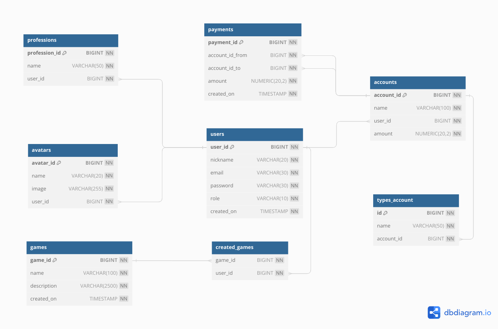

# ПСИК 
__Платёжно-расчётная система игры КарьерА__

Приложение для осуществление платёжных операций для экономической игры-симуляции [КарьерА](https://karyera-game.ru/) 
[Функциональные требования и пользовательские сценарии](https://disk.yandex.ru/i/yrcG8ZtPyOnHXg)

# ER Diagram

([click here to edit](https://dbdiagram.io/d/ER-Karyerapay-651c18e7ffbf5169f0f20d5a)) 

# Команда разработчиков
1. Андрей Устюжанин (Руководитель проекта, Тимлид)
2. Никита Миронов 
3. Константин
4. Варвара Матвеева
5. Владимир Савицкий
6. Дмитрий Петров 

# Фронтэнд 
7. Анна Вершиниа

# UX-дизайн
8. Марина Говорушко

# Тестирование
9. Александр Трифонов
10. Ксения Толпыго 
